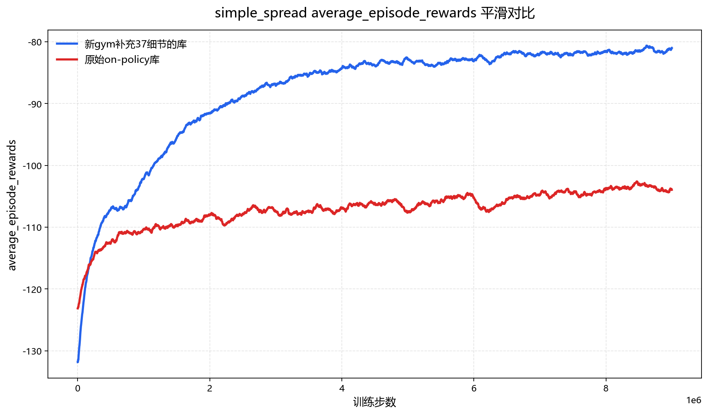

# MAPPO/MAT for Gymnasium MPE

这是一个面向后续研究与自定义环境开发的轻量级 MAPPO 基础库，基于
[`marlbenchmark/on-policy`](https://github.com/marlbenchmark/on-policy) 修改，并从
[`YijieWang-2024/on-policy`](https://github.com/YijieWang-2024/on-policy) 整理发布。

本项目只保留 Multi-Agent Particle Environments（MPE）以及以下算法：

- R-MAPPO / MAPPO / IPPO：`rmappo`、`mappo`、`ippo`
- Multi-Agent Transformer：`mat`、`mat_dec`

SMAC、Hanabi、Google Research Football、HAPPO、HATRPO 及其外部仿真器依赖均已移除。

## 与原始 on-policy 的区别

### Gymnasium 与 NumPy 2

- 依赖升级为 Gymnasium 和 NumPy 2。
- MPE `step()` 使用五元组：
  `(obs, reward, terminated, truncated, info)`。
- 环境达到外部步数上限时返回 `truncated=True`；只有任务本身真正结束时才返回
  `terminated=True`。
- MPE 随机数生成迁移至 Gymnasium `np_random`，支持可复现的
  `reset(seed=...)`。
- 修复了 `simple_attack` 场景原有的 `bound()` `NameError`。

主要实现位于：

- [`onpolicy/envs/mpe/environment.py`](onpolicy/envs/mpe/environment.py)
- [`onpolicy/envs/env_wrappers.py`](onpolicy/envs/env_wrappers.py)
- [`onpolicy/runner/shared/mpe_runner.py`](onpolicy/runner/shared/mpe_runner.py)
- [`onpolicy/runner/separated/mpe_runner.py`](onpolicy/runner/separated/mpe_runner.py)

### 正确区分 termination 与 truncation

Vector environment 会在 episode 结束后自动 reset。为了避免 reset observation
覆盖真实最终状态，本项目在自动 reset 前保存：

- `info["final_observation"]`
- `info["final_info"]`

Runner 使用真实的 `final_observation` 计算 transition 的 `next_value_preds`。每个
transition 显式保存自己的 `next_value_preds[t]`，不再依赖 buffer 下一格中可能已经
被 reset observation 替换的状态。

Return 与 GAE 计算使用两种不同含义的 mask：

- `masks[t + 1] = ~(terminated | truncated)`：重置 RNN，并阻止 GAE 跨越 episode。
- `bootstrap_masks[t] = ~terminated`：真正 termination 不 bootstrap；time-limit
  truncation 仍从真实最终状态 bootstrap。

对应的 GAE 逻辑为：

```text
delta_t = reward_t
          + gamma * bootstrap_mask_t * V(actual_next_obs_t)
          - V(obs_t)

gae_t = delta_t
        + gamma * gae_lambda * mask_(t+1) * gae_(t+1)
```

Buffer 实现位于：

- [`onpolicy/utils/shared_buffer.py`](onpolicy/utils/shared_buffer.py)
- [`onpolicy/utils/separated_buffer.py`](onpolicy/utils/separated_buffer.py)

### PPO 实现细节

本项目参考了
[The 37 Implementation Details of Proximal Policy Optimization](https://iclr-blog-track.github.io/2022/03/25/ppo-implementation-details/)
中讨论的工程细节，并重新审计了 rollout、buffer、return 和 recurrent mini-batch
索引。

原始实现已经包含：

- GAE
- Advantage normalization
- Mini-batch shuffle
- Policy clipping 与 value clipping
- Entropy bonus
- Gradient clipping
- Orthogonal initialization
- 随机种子
- 可选的线性学习率退火

本项目另外加入：

- `approx_kl`
- `clip_fraction`
- `explained_variance`
- 可选的 `--target_kl`，用于提前停止 PPO epoch
- 不丢弃余数样本的 mini-batch 划分
- 防止 recurrent chunk 跨越环境或 agent 轨迹边界的检查
- 修正 separated recurrent generator 的时间维与 batch 维排列
- 修正 MAT 在关闭 GAE 时的 advantage 计算

IPPO 会默认关闭 centralized critic 和 recurrent policy。

### Render

- 修复 shared-policy render 模式错误访问未初始化 wandb run 的问题。
- 补充 MPE render 所需的兼容版 `pyglet>=1.5,<2`。
- 支持从 checkpoint 加载 actor，并将 episode 保存为 GIF。

## 安装

项目目录本身不需要、也不建议作为 Python package 安装。请从项目根目录运行命令。

```bash
conda env create -f environment.yaml
conda activate marl
```

如果 `marl` 环境已经存在：

```bash
conda activate marl
pip install -r requirements.txt
```

## 训练

下面是用于 `simple_spread` 对比实验的命令：

```bash
python -m onpolicy.scripts.train.train_mpe \
  --env_name MPE \
  --algorithm_name mappo \
  --experiment_name train_5m \
  --scenario_name simple_spread \
  --num_agents 3 \
  --num_landmarks 3 \
  --seed 1 \
  --n_training_threads 1 \
  --n_rollout_threads 32 \
  --num_mini_batch 1 \
  --episode_length 15 \
  --num_env_steps 9000000 \
  --ppo_epoch 4 \
  --gain 0.01 \
  --lr 7e-4 \
  --critic_lr 7e-4 \
  --user_name local \
  --use_wandb
```

`--use_wandb` 是原始代码保留的反向开关：添加该参数会关闭 wandb，并在本地写入
TensorBoard 日志。

模型默认保存在：

```text
onpolicy/scripts/results/MPE/<scenario>/<algorithm>/<experiment>/runN/models/
```

## 与原始库的训练对比

下图使用上面的同一条训练命令，分别运行原始 `marlbenchmark/on-policy` 与本项目，
展示 `simple_spread` 的 `average_episode_rewards` 平滑曲线。



图中蓝线为迁移至 Gymnasium、补充 PPO 实现细节后的本项目，红线为原始 on-policy。
该结果来自一次固定配置与固定种子的实验，用于展示此次迁移后的实际运行表现，不应视为
跨场景或多随机种子的统计结论。

## 加载模型并保存一个 Episode

```bash
python -m onpolicy.scripts.render.render_mpe \
  --env_name MPE \
  --algorithm_name mappo \
  --experiment_name render_result \
  --scenario_name simple_spread \
  --num_agents 3 \
  --num_landmarks 3 \
  --seed 1 \
  --n_training_threads 1 \
  --n_rollout_threads 1 \
  --episode_length 15 \
  --render_episodes 1 \
  --ifi 0.1 \
  --gain 0.01 \
  --use_render \
  --save_gifs \
  --model_dir /absolute/path/to/runN/models
```

GIF 默认保存在：

```text
onpolicy/scripts/results/MPE/<scenario>/<algorithm>/<experiment>/runN/gifs/render.gif
```

加载 checkpoint 时，环境参数和网络结构参数必须与训练时保持一致。

## 测试

```bash
conda run -n marl python -m unittest discover -s tests -v
```

测试覆盖：

- Gymnasium 五元组接口
- seeded reset
- vector environment 自动 reset 与 `final_observation`
- termination / truncation bootstrap 语义
- GAE 与非 GAE return
- shared / separated buffer 的 `t` 与 `t + 1` 索引
- recurrent generator 的时间顺序和轨迹边界

## Citation

如果使用本项目，请引用原始 MAPPO 工作：

```bibtex
@inproceedings{
  yu2022the,
  title={The Surprising Effectiveness of {PPO} in Cooperative Multi-Agent Games},
  author={Chao Yu and Akash Velu and Eugene Vinitsky and Jiaxuan Gao and Yu Wang and Alexandre Bayen and Yi Wu},
  booktitle={Thirty-sixth Conference on Neural Information Processing Systems Datasets and Benchmarks Track},
  year={2022}
}
```
